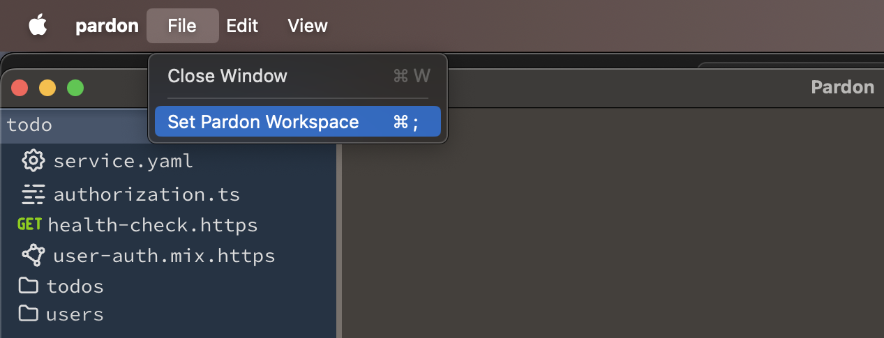
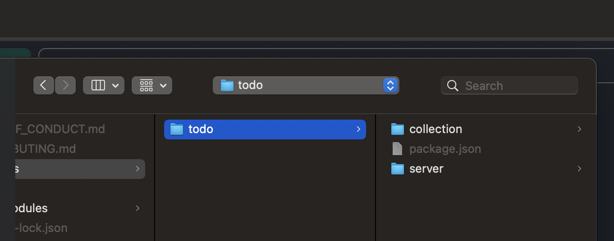
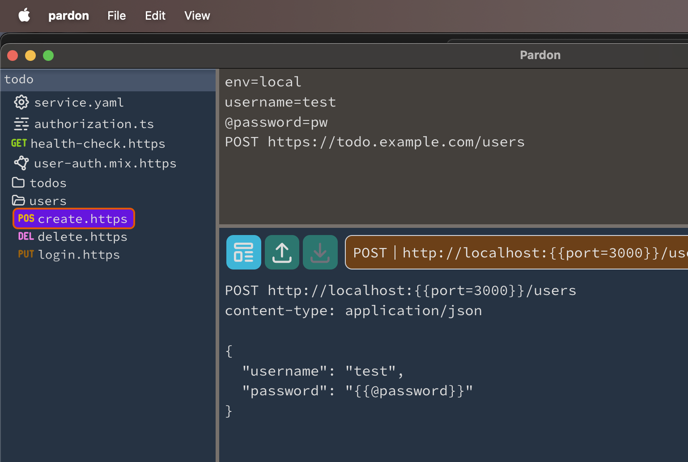

---
# Copyright 2025 Adobe. All rights reserved.
# This file is licensed to you under the Apache License, Version 2.0 (the "License");
# you may not use this file except in compliance with the License. You may obtain a copy
# of the License at http://www.apache.org/licenses/LICENSE-2.0

# Unless required by applicable law or agreed to in writing, software distributed under
# the License is distributed on an "AS IS" BASIS, WITHOUT WARRANTIES OR REPRESENTATIONS
# OF ANY KIND, either express or implied. See the License for the specific language
# governing permissions and limitations under the License.

title: Pardon Quickstart
description: Get running with a TODO app.
next: false
prev: false
---

[`http://localhost:3000`]: http://localhost:3000

import { FileTree, Aside } from '@astrojs/starlight/components';
import { CollectionLinkCard } from '@components';

:::tip
These docs assume a NodeJS installation and basic experience with 
`git`, `node`, and `npm`.

This should get you up and running.
:::

The `example/todo` directory in the pardon sources contains a sample server and Pardon collection.
This is actually the same collection and server used in the introduction.

We will use this to get startd with exploring the desktop and/or command-line applications.

## Installation and Building

To get started with Pardon, first build the Pardon application.
```bash title="building pardon"
$ git clone https://github.com/adobe/pardon.git
$ cd pardon
$ npm install
$ npm install --prefix=packages/core
$ npm install --prefix=packages/favor
$ npm run package --prefix=packages/favor # this also builds pardon's core
# --- optionally, to run this documentation locally --
$ npm install --prefix=packages/docs; npm start --prefix=packages/docs
```

<Aside type="caution" title="Building on Windows">
<details>
<summary>When building on windows, instead of using `--prefix`, please `cd` to the various subdirectories.</summary>
```bash title="powershell or cmd"
$ git clone https://github.com/adobe/pardon.git
$ cd pardon
$ npm install
$ cd packages/core
$ npm install
$ cd ../favor
$ npm install
$ npm run package
```
</details>
</Aside>

The Pardon application is built into `./packages/favor/out/...`
(the path depends on your plaform, we have not tested any linux flavors yet.)

Optionally, you can link the built application as a command-line tool as well.
```bash title="optional"
$ cd packages/core
$ npm link . # remove with: npm uninstall -g pardon
```

As a commmand-line program, `pardon` is like a simple but easier-to-use curl
that is enhanced with collections and can run `.http` files.

## Example todo service

The pardon source contains a simple server, and a pardon collection.

<FileTree>
- examples/todo
  - package.json           configures pardon
  - server                 an http service (data stored in memory)
    - index.js
    - mini-router.js
    - todo-service.js
  - collection/todo
    - service.yaml         common configuration for the todo service
    - user-auth.mix.https  common definition for authorized requests
    - authorization.ts     
    - health-check.https
    - users
      - create.https
      - login.https
      - delete.https
    - todos
      - list.https
      - create.https
      - get.https
      - delete.https
      - update.https
</FileTree>

After running `npm start`, please open a browser to [`http://localhost:3000`] to view the TODO list.

## Open the example workspace

It's time to run the pardon application (find it in `./packages/favor/out/...`) and
set the workspace to the `examples/todo` directory to pick up the configuration 
in `examples/todo/package.json`.

<div class="*:nth-1:origin-top-left *:nth-2:origin-bottom-right  relative">



</div>

When running the command line app, please run it from within this
folder.

Now enter this into the top input:

```http
env=local
username=test
@password=pw
POST https://todo.example.com/users
```

Pardon will show you the request it would send.



To send the request, click the large `[POST | http...]` button.

If the todo server is running, the user will be created with that password in the server.
Pardon will also persist the password as a secret.

You can run the same commands as the introduction, but with `env=local` added to
configure the requests for localhost.  (This ability to switch environments is one
of Pardon's key features.)

A `pardon.db` file is created in the workspace folder, this stores
every request and response pardon makes, but stripped of any secrets or derived secrets.
(Any secrets explicitly saved with the `secrets` mechanism are in their own tables.).

## Next Steps

Now that we've running, we can explore Pardon's inner workings,
starting with the template engine.

<CollectionLinkCard href="/intro/templates" />
